+ implementation for 
    + [cGANs with Projection Discriminator](https://arxiv.org/abs/1802.05637)

## Take-away

+ residual network with 1) spectral normalization 2) conditional discriminator with projection 3) conditional generator with conditional batchnormalization seems to give the best looking images with good diversity 

## resources

+ tensorflow (official) impl
    + https://github.com/pfnet-research/sngan_projection
+ pytroch impl 
    + https://github.com/crcrpar/pytorch.sngan_projection/
+ GAN training hacks https://github.com/soumith/ganhacks
    + sampling generative network on surface of sphere https://arxiv.org/pdf/1609.04468.pdf
    + avoid sparse gradients, i.e. ReLU, MaxPool, use LeakyReLU
    + downsample: average pooling, conv2d + stride
    + upsample: pixelshuffle, convtranspose2d + stride
    + stability tricks from RL https://arxiv.org/pdf/1610.01945.pdf
    + use labels, i.e. train discrimintor to also classify samples (AC-GAN)
    + add input noise https://www.inference.vc/instance-noise-a-trick-for-stabilising-gan-training/

## GAN w/ residual block 

#### with/without spectral normalization

    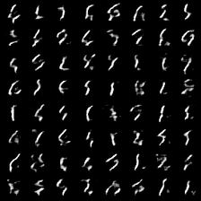
    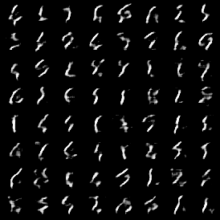
    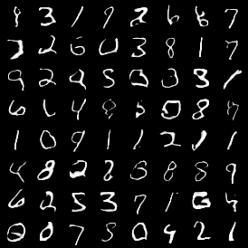
    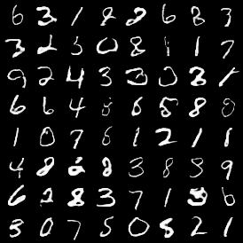

    
    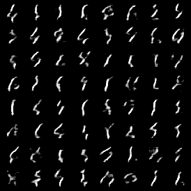
    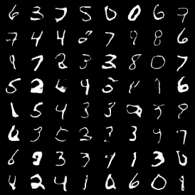
    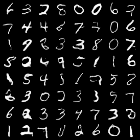

#### Compare conditional generator (both use conditional discriminator w/ projection)

##### Conditional Batchnorm

    
    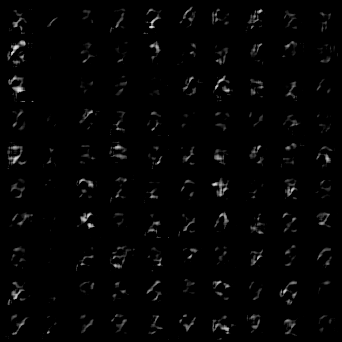
    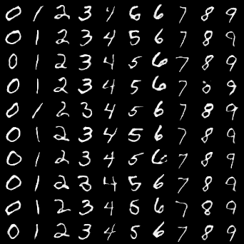
    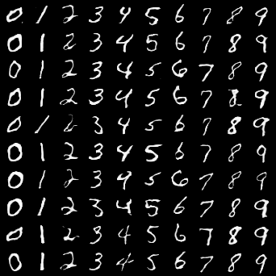

    
    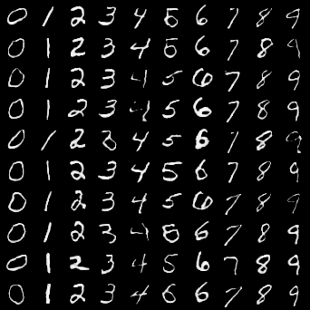
    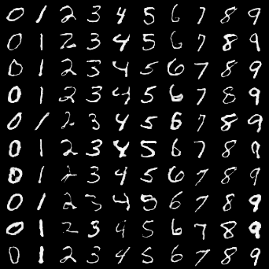
    

##### Concat c to z

    
    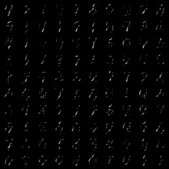
    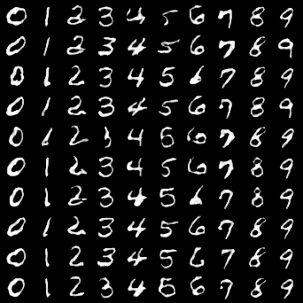
    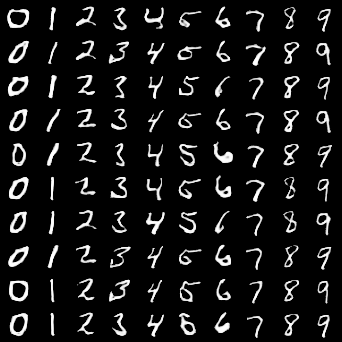

    
    
    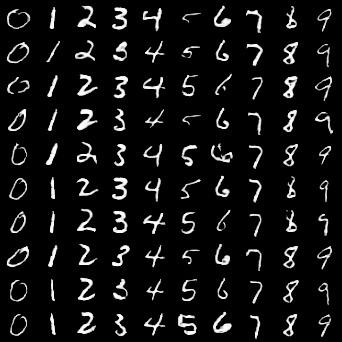
    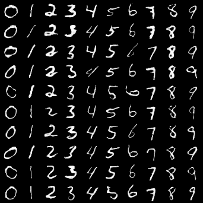

