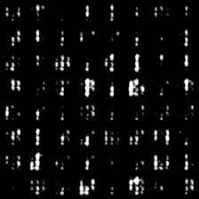
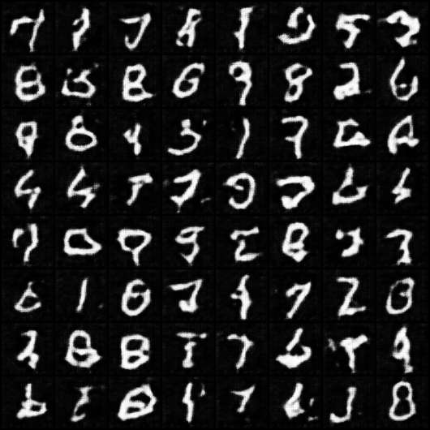
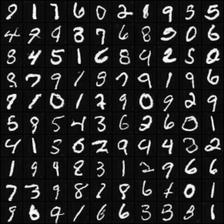
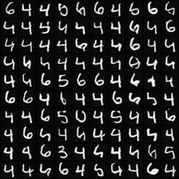
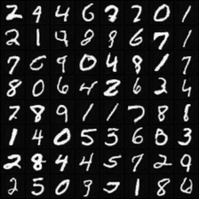
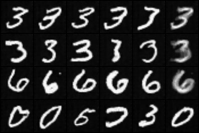

+ implementation for
    + [Unsupervised Representation Learning with Deep Convolutional Generative Adversarial Networks](https://arxiv.org/pdf/1511.06434.pdf)

#### Generating images (this impl)

  

#### Generating images (reference impl from pytorch-examples)

  

#### varying a single dimension of a latent vector in range [-0.05,0.05] with other dimension 0

  

#### varying all dimension of a latent vector in range [-1,1] with randomly sampled noise

  

#### interpolation between two randomly sampled latent vectors, alpha in [-0.5,1.5]

  

#### vector arithmetics on MNIST didn't really work ..

+ `z1 - z2 + z3`
  + `z1`: class=3, slanted
  + `z2`: class=3, straight
  + `z3`: class=6, arbitrary

  

## take-aways

+ initialization mattered !
    + the normal distribution initialization worked better than default initialization
+ the number of feature layers for conv layers mattered 
    + changing from 128 -> 64 worked on MNIST
+ a stronger (more feature layers) generator definitely helped with convergence
+ training GAN 
    + stability, saturation problem, needs to read more on GAN-training tricks

## tutorials

+ https://medium.com/@utk.is.here/keep-calm-and-train-a-gan-pitfalls-and-tips-on-training-generative-adversarial-networks-edd529764aa9
    + large kernel more filters
    + look at the gradients !
        + want generator conv weights to have large gradients early in training
    + flip labels (generated=1, data=0)
+ https://towardsdatascience.com/gan-ways-to-improve-gan-performance-acf37f9f59b
    + various variants of cost function
    + impl tips
        + scale between -1,1, use tanh as output layer for generator
        + add noise to real/generated image before feeding into discrimiantor