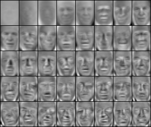
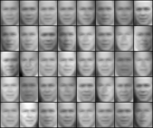
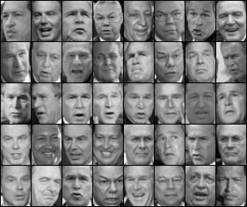

+ implementation for 
    + [A Tutorial on Principal Component Analysis](https://www.cs.cmu.edu/~elaw/papers/pca.pdf)
    + [Eigenfaces for Recognition](https://www.mitpressjournals.org/doi/10.1162/jocn.1991.3.1.71)

#### Original Data

    

#### Eigenfaces

    

#### Reconstructed data using first 5, 50, 100, 500 principal components

    

    

    

    

## references

+ [image dataset](https://scikit-learn.org/stable/auto_examples/applications/plot_face_recognition.html)