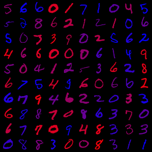

## resources

+ GAN training hacks https://github.com/soumith/ganhacks
    + sampling generative network on surface of sphere https://arxiv.org/pdf/1609.04468.pdf
    + avoid sparse gradients, i.e. ReLU, MaxPool, use LeakyReLU
    + downsample: average pooling, conv2d + stride
    + upsample: pixelshuffle, convtranspose2d + stride
    + stability tricks from RL https://arxiv.org/pdf/1610.01945.pdf
    + use labels, i.e. train discrimintor to also classify samples (AC-GAN)
    + add input noise https://www.inference.vc/instance-noise-a-trick-for-stabilising-gan-training/

+ pytorch implementation of cGAN with projection 
    + https://github.com/crcrpar/pytorch.sngan_projection

## ColorMNIST 

ColorMNIST for prototyping models
+ Similar to chest X-ray
+ Interpolate between two colors 
+ Binary color label, 0-blue 1-red

    

## PE on Color MNIST 

    

